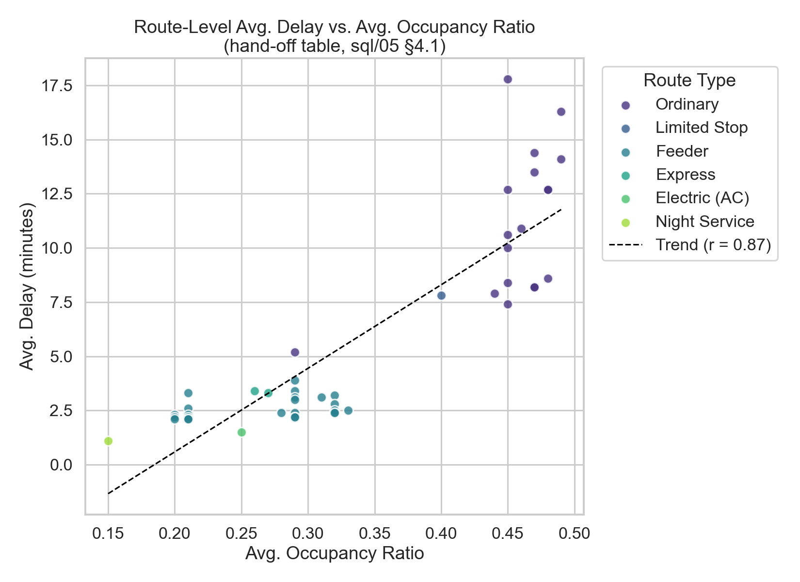
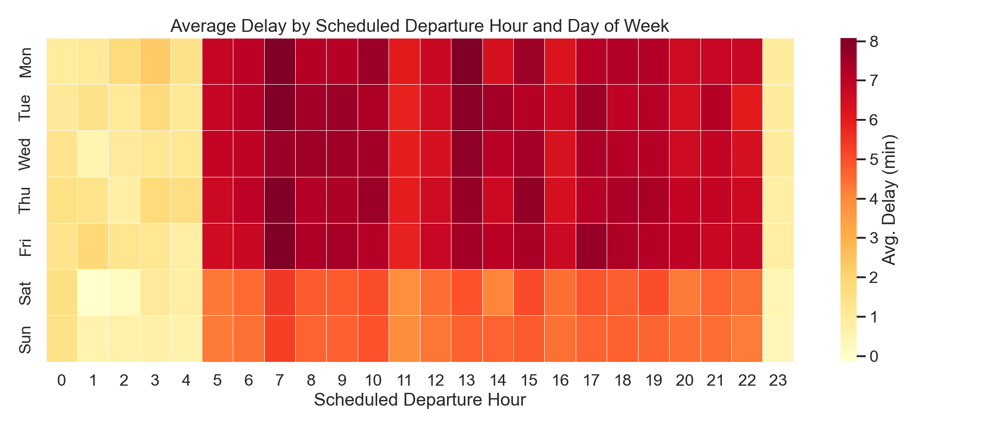
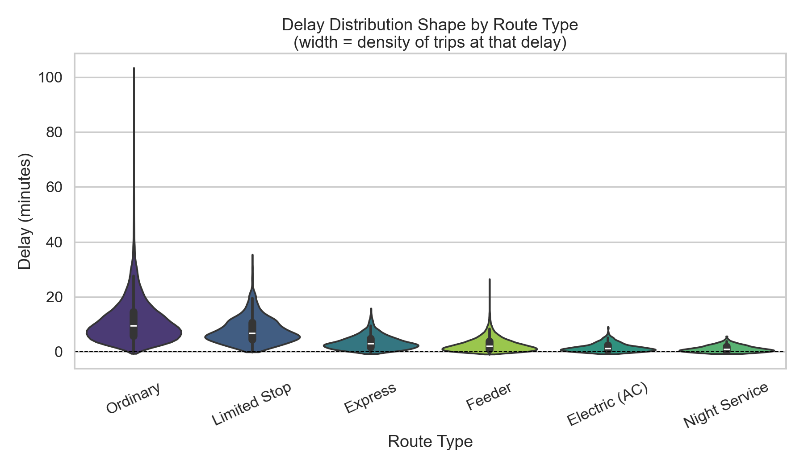

# Delay Driver Analysis — Phase 4

**Generated by:** `python/04_delay_analysis.py`
**Purpose:** Statistical investigation of delay drivers extending
`sql/05_delay_analysis.sql`. Covers three angles not already surfaced in
Phase 3's SQL output — delay-vs-occupancy correlation, an hour x
day-of-week heatmap, and delay distribution shape by route type.
Bus-type delay is intentionally not repeated here; it's already covered
in `sql/03_route_performance.sql` §5.1.

## 1. Does Congestion Track With Delay? (the Phase 3 §4.1 hand-off)

Across the network's 47 routes, average delay and average
occupancy ratio show **a strong positive correlation** (Pearson r = **0.873**,
statistically significant at p < 0.0001).

**Correlation, not causation** (per `docs/assumptions.md` rule #5): this
doesn't prove overcrowding *causes* delay — both could share a common
driver (e.g. high-traffic corridors generate both more riders and more
congestion). But the direction is consistent with the intuitive story:
routes that run fullest also tend to run latest, which strengthens the
case for the donor/receiver reallocation already proposed in
`sql/06_advanced_analysis.sql` §3 — moving buses to overcrowded routes may
help reliability, not just comfort.

## 2. When Are Delays Worst? (hour x day-of-week)

Worst single hour/day combination: **Mon at 13:00**
(avg. 8.1 min delay). Network-wide, weekday departures
average **7.1 min** delay vs. **4.7 min** on
weekends — consistent with weekday peak-hour congestion being the primary
delay driver rather than a network-wide scheduling issue.

## 3. Delay Distribution Shape by Route Type

Most variable (least predictable) delay: **Ordinary**
(std. dev. 7.6 min). Most consistent: **Night Service**
(std. dev. 1.2 min). This matters operationally
beyond the average: a route with high variance is unreliable even on days
its *average* delay looks acceptable, which the mean-only figures in
`sql/03` and `sql/05` can't show on their own.

---
_Angles 1-3 above are new statistical views (correlation, 2-D time
pattern, distribution shape); the underlying delay and occupancy
definitions are unchanged from the audited Phase 3 SQL._
