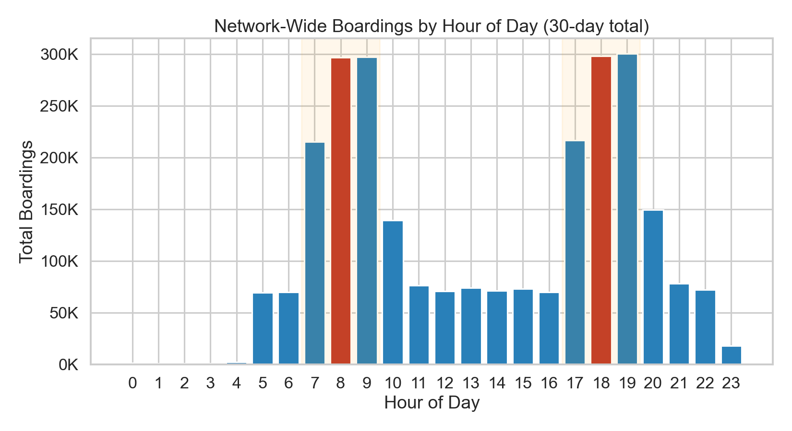
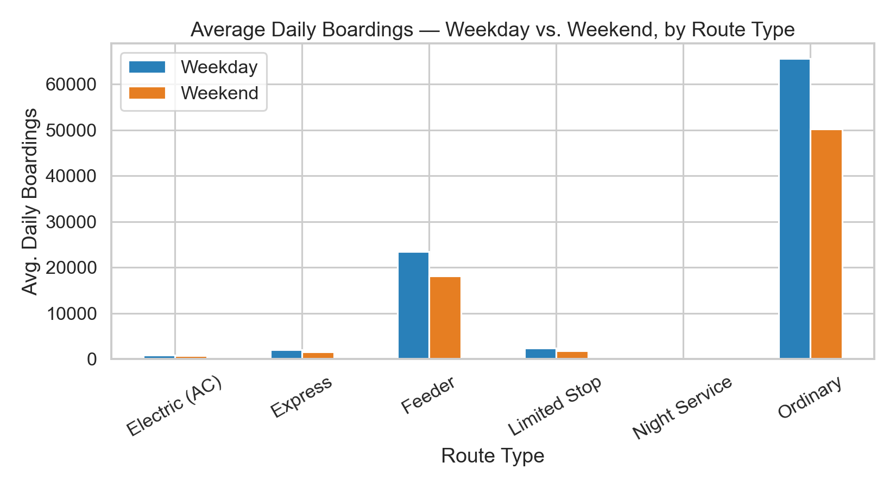
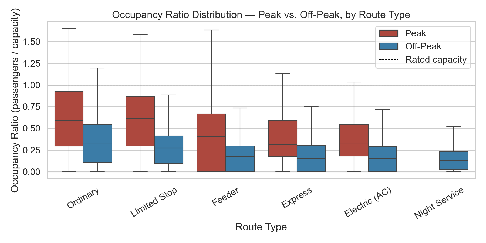
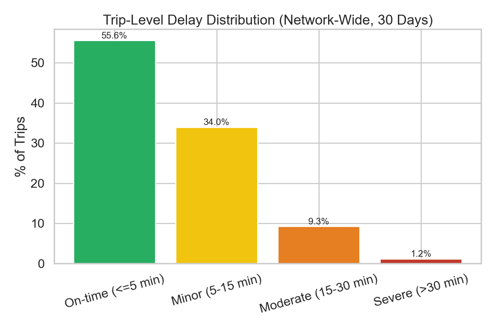
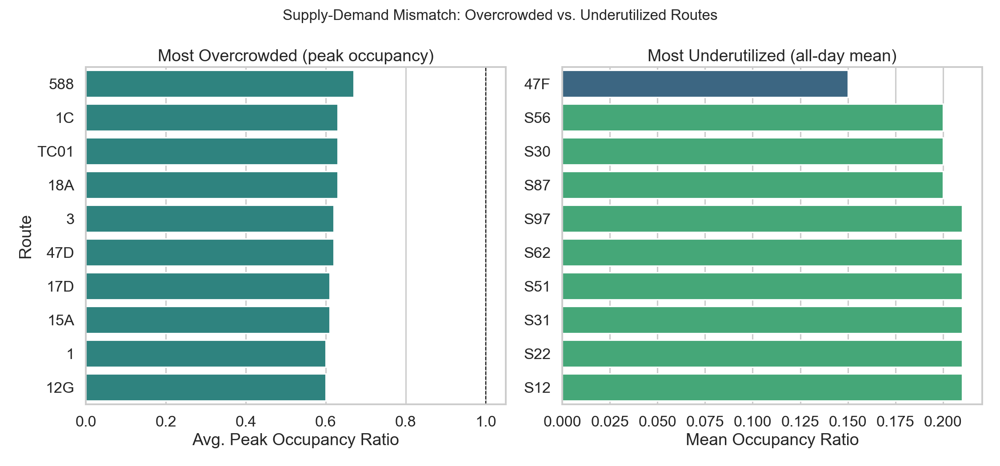
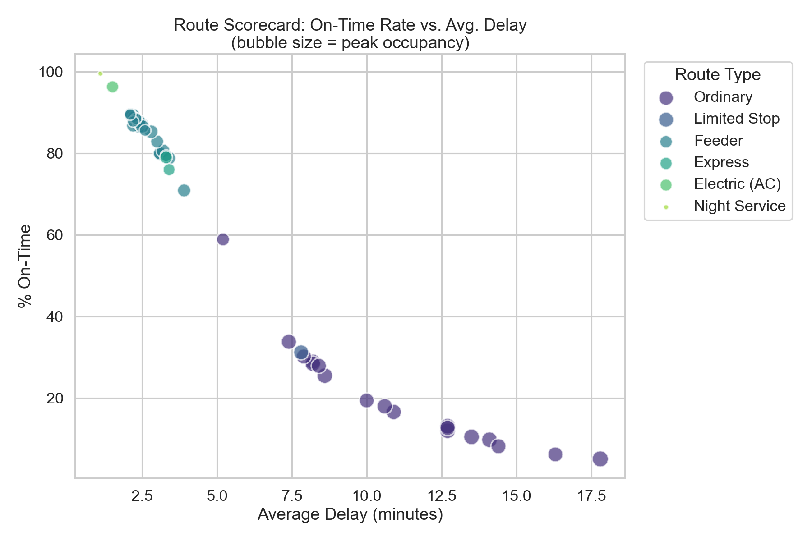

# EDA Summary — Phase 4

**Generated by:** `python/02_eda.py`
**Purpose:** Visual counterpart to Phase 3 SQL analytics — same validated
definitions (on-time = arrival within 5 min of schedule; peak = 07:00-10:00
/ 17:00-20:00), rendered as charts for faster pattern recognition and for
reuse in the Phase 5 Power BI narrative and Phase 6 write-up.

## 1. Hourly Demand

Busiest hours network-wide: 19:00 (11.3% of daily boardings); 18:00 (11.2% of daily boardings). Confirms the two documented
peak windows (07:00-10:00, 17:00-20:00) from Phase 3.

## 2. Weekday vs. Weekend Demand

Network-wide weekend-to-weekday boarding ratio: **0.77x**
(a blended Sat+Sun figure — individual Sat ~0.85x / Sun ~0.65x targets are
documented separately in `docs/assumptions.md`).

## 3. Occupancy: Peak vs. Off-Peak

Network average occupancy ratio — Peak: **0.514**, Off-Peak: **0.287**.
Ordinary and Limited Stop routes show the widest peak/off-peak spread and the
most boxes crossing the rated-capacity (1.0) line.

## 4. Delay Distribution

Trip-level breakdown: On-time (<=5 min): 55.6%, Minor (5-15 min): 34.0%, Moderate (15-30 min): 9.3%, Severe (>30 min): 1.2%.
Matches the Phase 3 `sql/05_delay_analysis.sql` network-wide bucket figures.

## 5. Overcrowded vs. Underutilized Routes

Most overcrowded: **588** (avg. peak occupancy 0.67).
Most underutilized: **47F** (mean occupancy 0.15).
This is the visual counterpart to the donor/receiver pairing in
`sql/06_advanced_analysis.sql` §3.

## 6. Route Scorecard

Highest average delay: **588** (17.8 min, 5.1% on-time).
Lowest average delay: **47F** (1.1 min, 99.6% on-time).
Bubble size = average peak occupancy, so routes in the bottom-right with
large bubbles are the clearest "overcrowded AND unreliable" candidates for
Phase 6 recommendations.

---
_All figures are derived directly from the same SQL logic validated in
Phase 3 (`sql/02-06`); no new metrics are introduced in this file._
