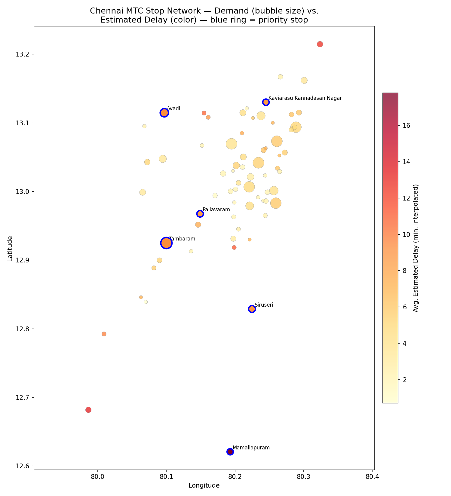

# Geospatial Analysis Summary — Phase 4

**Generated by:** `python/03_geospatial_analysis.py`
**Purpose:** Map demand and estimated delay across the real Chennai MTC
stop network, surfacing the same "priority stops" already flagged in
`sql/06_advanced_analysis.sql` §4.1 (top quartile for BOTH demand AND
estimated delay) — this file adds the geography, not new metrics.

**Caveat (inherited from `sql/05_delay_analysis.sql`):** stop-level delay
is *interpolated* by distributing each trip's scheduled duration
proportionally along `route_stops.distance_from_origin_km`, since the
schema only stores trip-level scheduled times. Treat these figures as
directional hotspot indicators, not precise measurements — trip-level
delay (`sql/03_route_performance.sql`, charted in `02_eda.py`) remains the
reliable figure.

## Static Overview

Bubble size = total boardings + alightings at the stop; color = estimated
average delay; a blue ring marks a **priority stop** (top quartile on both
dimensions — 6 of 70 stops qualify).

## Interactive Map
An interactive version with per-stop popups (hover for exact figures, click
markers to expand clusters) is saved separately at
[`reports/maps/priority_stops_map.html`](maps/priority_stops_map.html) —
open it directly in a browser (not renderable inline in Markdown/GitHub
previews).

## Priority Stops (6 stops)

| Stop | Zone | Total Activity | Est. Avg Delay (min) |
|---|---|---:|---:|
| Tambaram | Chennai Metropolitan Area | 331,204 | 9.2 |
| Avadi | Chennai Metropolitan Area | 172,652 | 9.2 |
| Siruseri | Chennai Metropolitan Area | 109,725 | 8.8 |
| Pallavaram | Chennai Metropolitan Area | 95,672 | 8.1 |
| Kaviarasu Kannadasan Nagar | Chennai Metropolitan Area | 91,603 | 8.4 |
| Mamallapuram | Chennai Metropolitan Area | 86,242 | 17.8 |

These are the strongest candidates for on-the-ground investigation
(e.g. inadequate dwell time, junction congestion, signal timing) — high
enough demand that delay there affects many riders, and high enough
estimated delay that it's a real bottleneck rather than noise.

## Top 5 Stops by Estimated Delay (regardless of demand)

| Stop | Est. Avg Delay (min) | Total Activity |
|---|---:|---:|
| Mamallapuram | 17.8 | 86,242 |
| Chengalpet | 13.5 | 66,195 |
| Ennore | 12.7 | 67,226 |
| Medavakkam | 11.2 | 27,021 |
| Ambattur Estate | 10.9 | 29,947 |

Consistent with the Phase 3 finding that delay accumulates toward route
termini (`PROGRESS.md` §4): the highest-delay stops here are predominantly
end-of-line locations far from route origins.

---
_All figures derive from the same demand and interpolated-delay logic
validated in Phase 3 (`sql/05-06`), now joined to real stop coordinates;
no new metrics are introduced in this file._
